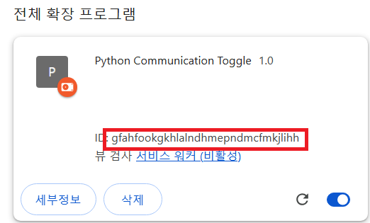

# 균형 읽기 프로그램

  

이 프로그램은 Chrome 확장 프로그램과 Google Gemini API를 연동하여 에코 챔버(Echo Chamber)현상을 해결하기 위한 프로그램입니다.

  

## 설치 및 실행 방법

  

### 1. 크롬 확장 프로그램 설치

  

1. Chrome 브라우저에서 `chrome://extensions` 주소로 이동합니다.

2.  **오른쪽 상단의 "개발자 모드"를 활성화**합니다.

3.  **"압축해제된 확장 프로그램 로드"** 버튼을 클릭합니다.

4. 이 저장소의 `extension/` 폴더를 선택합니다.

5. 확장 프로그램이 설치되면, **확장 프로그램 ID**를 복사해둡니다.

- 확장 프로그램 ID는 확장 프로그램 카드의 하단 또는 `chrome://extensions` 페이지에서 확인할 수 있습니다.

  

### 2. 설정 파일 수정

  

1. 프로젝트 루트 디렉토리에 있는 `host.json` 파일을 엽니다.

2.  `"allowed_origins"` 항목에 위에서 복사한 확장 프로그램 ID를 입력합니다.

  

기존 `host.json` 파일:

  

```json
{
	"name": "com.example.nativehost",
	"description": "Python Native Host",
	"path": "__REPLACED_BY_INSTALL_SCRIPT__",
	"type": "stdio",
	"allowed_origins": ["chrome-extension://<<< CHANGE HERE FOR EXTENSION ID >>>/"]
}
```

수정된 `host.json` 파일 예시:
```json
{
	...
	"allowed_origins": ["chrome-extension://gfahfookgkhlalndhmepndmcfmkjlihh/"]
}
```

  

### 3. 패키지 설치 

```bash
pip install plyer
pip install google.generativeai
pip install bs4
```

  

## 🔧 구성 파일 설명

  

-  `host.json`: 확장 프로그램과 통신하기 위한 설정 파일입니다. 반드시 정확한 ID가 입력되어야 합니다.

  

---

  

## ❗ 주의 사항

- Chrome 확장 프로그램은 반드시 **개발자 모드에서 수동으로 설치**해야 합니다.

-  `host.json`의 `"extension_id"`가 올바르지 않으면 확장 프로그램과의 연동이 실패합니다. 

---